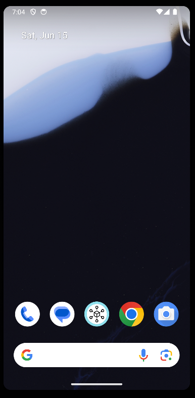
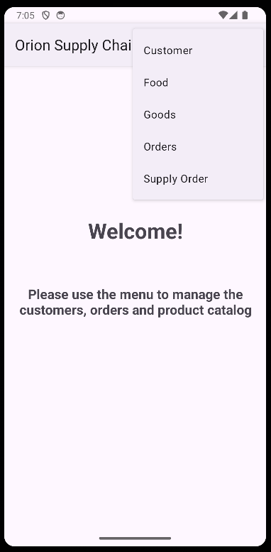
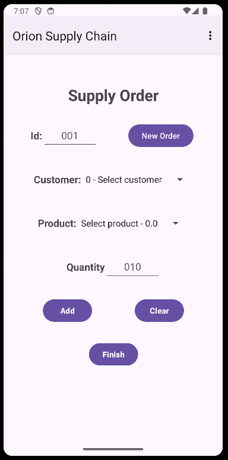

# Mobile Programming - Orion Supply Chain

A repository containing the application "Orion Supply Chain", developed as a final project on the Mobile Programming course.


## Description

"Orion Supply Chain" is an application focused on ordering and delivering products (food and household goods) to nearby stores. 


## Getting Started

The apk file is located in the "OrionSupplyChain\app\build\outputs\apk\androidTest\debug\". 

### Dependencies

### Folder Structure

````
PROJECTS - Mobile PROGRAMMING - ORIONSC
├── OrionSupplyChain
├── Resources
├── .gitignore
├── LICENSE
└── README.md
````

## Screenshots

**Application Icon**



**Initial Screen**



**Supply Order Page**



## Video

**Presentation video**


## Authors

 - deArruda, Lucas [@SardinhaArruda](https://twitter.com/SardinhaArruda)

## Version History


## License

This project is licensed under the GPL-3.0 License - see the LICENSE.md file for details

## Acknowledgments

This README.md was based the amazing [README-Template](https://gist.github.com/DomPizzie/7a5ff55ffa9081f2de27c315f5018afc).